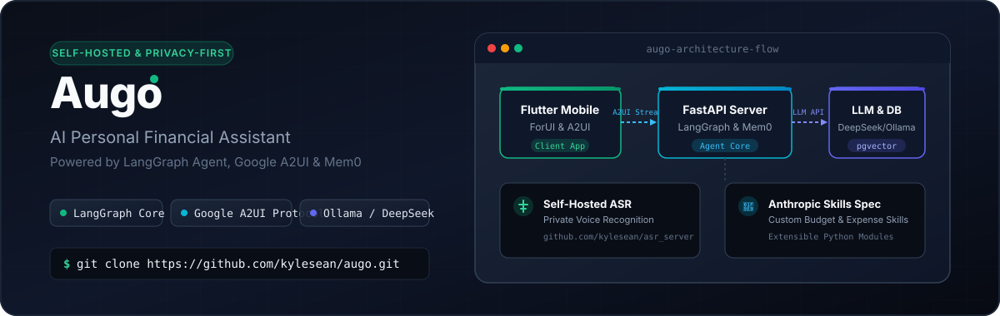
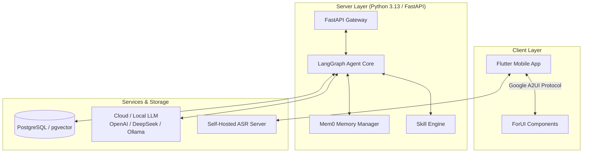

<p align="right">
  <strong>English</strong> · <a href="./README_ZH.md">简体中文</a>
</p>

<p align="center">
  
</p>

<p align="center">
  <a href="https://github.com/kylesean/Finvo/blob/main/LICENSE"></a>
  <a href="https://www.python.org/downloads/release/python-3130/"></a>
  <a href="https://flutter.dev"></a>
  <a href="https://fastapi.tiangolo.com"></a>
  <a href="https://www.langchain.com/langgraph"></a>
</p>

---

<p align="center">
  Finvo is an open-source, <strong>self-hosted AI financial assistant</strong> designed to manage personal and family finances with complete data privacy. Operating on your own infrastructure, it retains conversation memory, connects seamlessly to both cloud LLMs and local models, and renders interactive UI components dynamically.
</p>

---

<p align="center">
  
  
  
  
</p>

---

## Key Features

- **Agent-Based Orchestration (LangGraph + Mem0)**
  Goes far beyond static transaction logging. Finvo uses LangGraph for multi-step financial reasoning, automatic self-correction, long/short-term memory management via Mem0, and complex querying via natural conversation.

- **100% Self-Hosted & Privacy-First**
  Keep your ledger and AI memories entirely within your local network. Supports private voice recognition via the customized [asr_server](https://github.com/kylesean/asr_server) project, ensuring voice data never leaks to third parties.

- **Model-Agnostic LLM Connectivity**
  No vendor lock-in. Connect seamlessly to cloud LLMs (**OpenAI**, **DeepSeek**, **Qwen**) or run 100% offline with local LLM frameworks like **Ollama**.

- **Dynamic UI Streaming (Google A2UI Protocol)**
  Powered by the **Google A2UI** protocol and built with [forui](https://github.com/duobaseio/forui). The AI agent dynamically pushes custom interactive widgets (charts, breakdown cards, transaction confirmations) directly into the app stream based on context.

- **Extensible Anthropic-Style Skills**
  Supports plugin skills following the **Anthropic Skills** standard. Add python-based skill modules for advanced capabilities like specialized budget planning, investment tracking, and custom expense analysis.

- **NAS & Home Server Optimized**
  Pre-packaged for one-click deployment on **Synology**, **QNAP**, Unraid, or standard Docker hosts. Includes multi-member family sharing support out of the box.

---

## Architecture



---

## Tech Stack

| Component | Technology | Purpose |
| :--- | :--- | :--- |
| **Backend** | Python 3.13 + FastAPI + `uv` | High-performance API server & dependency management |
| **AI Agent Core** | LangGraph + Mem0 | Multi-step reasoning, intent dispatching & memory |
| **Frontend App** | Flutter + ForUI | Cross-platform mobile UI with dynamic A2UI renderer |
| **Database** | PostgreSQL + `pgvector` | Transaction records & vector embeddings |
| **Voice / ASR** | `asr_server` | Local, self-hosted Speech-to-Text processing |

---

## Quick Start

### Prerequisites
- **Docker & Docker Compose** (Recommended)
- **AI Model API Key** (e.g., DeepSeek, OpenAI, Qwen) OR a local **Ollama** endpoint

### Docker Deployment

1. **Clone the Repository**:
   ```bash
   git clone https://github.com/kylesean/Finvo.git
   cd Finvo
   ```

2. **Configure Environment Variables**:
   ```bash
   cp server/.env.example server/.env
   # Edit server/.env with your preferred LLM provider credentials
   ```

3. **Launch Containers**:
   ```bash
   make docker-up
   ```

> Once started, scan the QR code displayed in the terminal using the Flutter Mobile App to pair immediately.

---

## Repository Structure

```text
Finvo/
├── client/              # Flutter mobile application codebase
│   └── assets/images/   # Screenshots and brand assets
├── server/              # FastAPI backend & LangGraph Agent service
│   ├── app/             # Core application logic & API endpoints
│   └── .env.example     # Environment template
├── docker-compose.yml   # Multi-container deployment configuration
└── Makefile             # Developer shortcuts & lifecycle scripts
```

---

## License

This project is open-source under the [AGPL-3.0 License](LICENSE).
