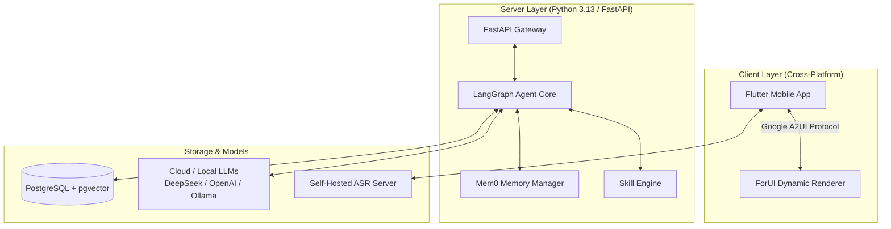

<p align="right">
  <strong>English</strong> · <a href="./README_ZH.md">简体中文</a>
</p>

<p align="center">
  
</p>

<p align="center">
  <a href="https://github.com/kylesean/Finvo/blob/main/LICENSE"></a>
  <a href="https://www.python.org/downloads/release/python-3130/"></a>
  <a href="https://flutter.dev"></a>
  <a href="https://fastapi.tiangolo.com"></a>
  <a href="https://www.langchain.com/langgraph"></a>
</p>

---

<p align="center">
  <strong>Finvo</strong> is an open-source, <strong>self-hosted AI expense tracker & personal finance agent</strong>.<br>
  It leverages conversational LLMs and private speech recognition to effortlessly record expenses, visualize financial analytics, and manage household budgets with 100% data privacy.
</p>

> [!NOTE]
> **The Story Behind Finvo**
> **Finvo** = **Fin**ance + **Vo**ice / **Vo**ce / **Vo**lution
> **Core Mission**: Voice & dialogue-driven AI expense tracking and personal finance assistant.

---

<p align="center">
  
  
  
  
</p>

---

## Key Features

### 1. Natural Language & Private Voice Bookkeeping
- **Effortless Expense Logging**: Record expenses as simply as chatting or speaking. Say "Spent $45 on grocery shopping" or "Paid $800 for rent", and the AI agent automatically extracts amount, category, merchant, and timestamp.
- **Privacy-First Voice ASR**: Integrated with self-hosted [asr_server](https://github.com/kylesean/asr_server). Speech-to-text processing happens entirely on your local infrastructure with zero audio data sent to commercial APIs.

### 2. Dynamic UI Streaming & Interactive Analytics (Google A2UI)
- **Real-Time Dynamic Widgets**: Powered by Google A2UI protocol and [forui](https://github.com/duobaseio/forui). The AI agent dynamically renders interactive charts, breakdown cards, transaction confirmation dialogs, and edit forms inside the conversation stream.
- **Multidimensional Insights**: Ask "How much did I spend on dining out this month?" or "Am I over budget compared to last month?" to receive instant visual breakdowns.

### 3. 100% Self-Hosted & Model-Agnostic
- **Complete Data Sovereignty**: Ledger databases, vector embeddings, and conversation memories remain strictly inside your local network.
- **Model Agnostic**: Seamlessly connect cloud LLMs (DeepSeek, OpenAI, Qwen) or run 100% offline with local frameworks like Ollama.

### 4. Shared Ledgers & Multi-Member Collaboration
- **Family & Team Workspaces**: Support for shared spaces allowing family members to log transactions jointly, assign budgets, and maintain granular access control.

### 5. Agentic Memory & Extensible Anthropic-Style Skills
- **Mem0 Context Memory**: Retains user habits, frequent merchants, and personal budgeting preferences across sessions.
- **Plugin Skill Engine**: Modular Python skills following Anthropic-style skill specifications. Easily add custom modules for financial forecasting, exchange rate conversion, fixed bill scheduling, and budget alerts.

---

## Architecture



---

## Tech Stack

| Component | Technology | Purpose & Advantage |
| :--- | :--- | :--- |
| **Backend API** | Python 3.13 + FastAPI + `uv` | Asynchronous API gateway with lightning-fast dependency management |
| **AI Agent Core** | LangGraph + Mem0 | Multi-step reasoning, self-correction, and contextual memory management |
| **Frontend App** | Flutter + ForUI | Cross-platform mobile UI with dynamic A2UI renderer |
| **Database** | PostgreSQL + `pgvector` | Transaction storage and vector embeddings |
| **Voice / ASR** | `asr_server` | Local, self-hosted Speech-to-Text processing |

---

## Quick Start

### Prerequisites
- **Docker & Docker Compose** (Recommended)
- **AI Model Key** (DeepSeek, OpenAI, Qwen) or a local **Ollama** endpoint

### Deployment Steps

1. **Clone Repository**:
   ```bash
   git clone https://github.com/kylesean/Finvo.git
   cd Finvo
   ```

2. **Configure Environment**:
   ```bash
   cp server/.env.example server/.env
   # Edit server/.env with your LLM provider credentials or Ollama URL
   ```

3. **Launch Docker Services**:
   ```bash
   make docker-up
   ```

> [!TIP]
> Once started, scan the QR code displayed in the terminal using the Flutter Mobile App to pair immediately.

---

## Repository Structure

```text
Finvo/
├── client/              # Flutter mobile application codebase
│   └── assets/images/   # Screenshots and brand assets
├── server/              # FastAPI backend & LangGraph Agent service
│   ├── app/             # Application core, services, and skills
│   └── .env.example     # Environment template
├── docker-compose.yml   # Multi-container deployment configuration
└── Makefile             # Developer shortcuts & lifecycle scripts
```

---

## License

This project is open-source under the [AGPL-3.0 License](LICENSE).
