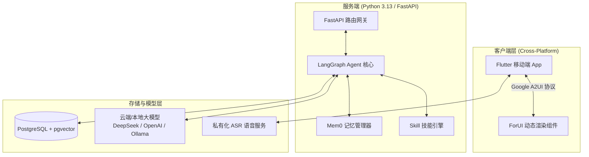

<p align="right">
  <a href="./README.md">English</a> · <strong>简体中文</strong>
</p>

<p align="center">
  
</p>

<p align="center">
  <a href="https://github.com/kylesean/Finvo/blob/main/LICENSE"></a>
  <a href="https://www.python.org/downloads/release/python-3130/"></a>
  <a href="https://flutter.dev"></a>
  <a href="https://fastapi.tiangolo.com"></a>
  <a href="https://www.langchain.com/langgraph"></a>
</p>

---

<p align="center">
  <strong>Finvo</strong> 是一款开源、<strong>支持私有化部署的 AI 智能记账与个人财务助手</strong>。<br>
  它结合自然语言对话与私有化语音识别，帮您瞬间提取账目，并通过动态 UI 实时推拉图表与分析。所有数据与 AI 记忆均保存在您的私有设备中。
</p>

> [!NOTE]
> **Finvo 命名寓意**
> **Finvo** = **Fin**ance（财务/账目） + **Vo**ice / **Vo**ce / **Vo**lution（语音/意图/声音）
> **定位**：用“声音与对话”驱动的智能记账与个人财务 Agent。

---

<p align="center">
  
  
  
  
</p>

---

## 核心特性

### 1. 对话与私有语音极速记账
- **像聊天一样随手记账**：无需繁琐点击和手动分类。只需输入或说出“今天吃火锅花了 120”、“昨天加油 300 块”，AI 自动提取金额、类别与时间。
- **私有化语音识别 (ASR)**：集成自建 [asr_server](https://github.com/kylesean/asr_server) 语音服务，语音转文字全在本地完成，彻底告别商业语音 API 的隐私泄露风险。

### 2. 动态 UI 流与可视化分析 (Google A2UI)
- **实时推拉交互组件**：基于 Google A2UI 协议与 [forui](https://github.com/duobaseio/forui) 组件库。AI Agent 在对话中自动渲染消费饼图、趋势折线图、确认卡片与编辑表单。
- **多维度消费洞察**：随时询问“本月餐饮花了多少？”或“比上月超支了吗？”，智能分析消费结构并给出可视化反馈。

### 3. 100% 私有部署与数据自主控制
- **全链路本地自治**：账目数据库、向量索引及 AI 记忆全部驻留您的私有网络。
- **模型无关 (Model-Agnostic)**：自由无缝接入 DeepSeek、OpenAI、Qwen 等云端大模型，或通过 Ollama / LocalAI 运行 100% 离线本地模型。

### 4. 家庭共享账本与协同管理
- **多成员空间管理**：支持创建家庭或团队共享账本，成员协同记账、权限隔离与预算分配，满足家庭与小团队的财务协作需求。

### 5. Agent 长期记忆与 Anthropic Skill 扩展
- **Mem0 智能记忆管理**：自动记住用户的记账习惯、常用商家与偏好，越用越懂你。
- **Python 插件化 Skill**：遵循类 Anthropic Skills 规范。开发者可编写轻量 Python 脚本扩展专项预测、外汇汇率换算、固定周期账单与预算预警等专业技能。

---

## 系统架构



---

## 技术选型

| 模块 | 技术栈 | 用途与优势 |
| :--- | :--- | :--- |
| **后端 API** | Python 3.13 + FastAPI + `uv` | 高性能异步接口服务，极速依赖管理 |
| **AI Agent** | LangGraph + Mem0 | 多步骤任务推理、自动纠错与长短期记忆 |
| **前端应用** | Flutter + ForUI | 高颜值跨平台 App，适配 A2UI 动态 UI 协议 |
| **数据存储** | PostgreSQL + `pgvector` | 交易流水持久化与 AI 向量嵌入检索 |
| **语音识别** | `asr_server` | 私有化离线 Speech-to-Text 语音转文字 |

---

## 快速开始

### 前置条件
- **Docker & Docker Compose** (推荐部署方式)
- **大模型 API Key**（如 DeepSeek、OpenAI、Qwen）或 **本地 Ollama 服务**

### 一键部署步骤

1. **克隆项目**:
   ```bash
   git clone https://github.com/kylesean/Finvo.git
   cd Finvo
   ```

2. **配置环境变量**:
   ```bash
   cp server/.env.example server/.env
   # 编辑 server/.env 填入您的 LLM API Key 或 Ollama 地址
   ```

3. **启动 Docker 服务**:
   ```bash
   make docker-up
   ```

> [!TIP]
> 服务启动完成后，命令行中将自动生成连接二维码。打开 Flutter Client 扫描终端二维码即可快速绑定并开始使用。

---

## 项目结构

```text
Finvo/
├── client/              # Flutter 跨平台客户端源码
│   └── assets/images/   # 应用截图与品牌资源
├── server/              # FastAPI 后端与 LangGraph Agent 服务
│   ├── app/             # 业务逻辑、API 路由、Services 与 Skills
│   └── .env.example     # 环境变量模板
├── docker-compose.yml   # 容器编排文件
└── Makefile             # 常用快捷指令
```

---

## 开源协议

本项目采用 [AGPL-3.0 License](LICENSE) 开源协议。
