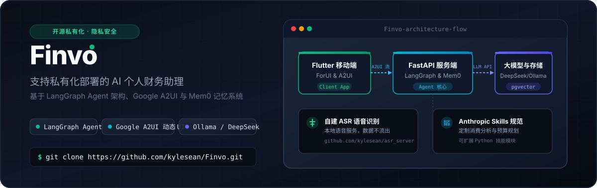
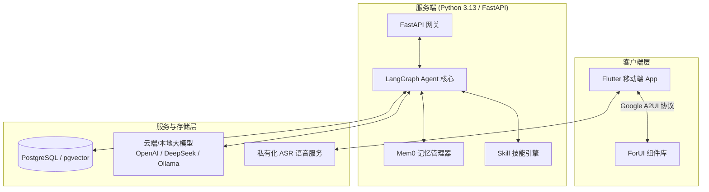

<p align="right">
  <a href="./README.md">English</a> · <strong>简体中文</strong>
</p>

<p align="center">
  
</p>

<p align="center">
  <a href="https://github.com/kylesean/augo/blob/main/LICENSE"></a>
  <a href="https://www.python.org/downloads/release/python-3130/"></a>
  <a href="https://flutter.dev"></a>
  <a href="https://fastapi.tiangolo.com"></a>
  <a href="https://www.langchain.com/langgraph"></a>
</p>

---

<p align="center">
  Augo 是一款开源的 <strong>AI 财务助理</strong>，核心特色是支持完全私有化部署。它能帮助您管理个人及家庭财务，账目数据与 AI 记忆均保存在您的私有环境中，并可灵活接入各类云端大模型或本地模型，配合动态 UI 渲染带来极致的智能交互体验。
</p>

---

<p align="center">
  
  
  
  
</p>

---

## 核心特性

- **基于 LangGraph + Mem0 的智能 Agent**
  超越传统的静态流水记录，Augo 采用 LangGraph 进行多步骤财务推理、自动纠错，并通过 Mem0 管理长短期对话记忆，支持自然语言下的复杂财务查询与分析。

- **100% 私有化部署与隐私安全**
  数据与 AI 记忆全部驻留本地网络。集成 [asr_server](https://github.com/kylesean/asr_server) 自建语音识别服务，让语音数据不出私有环境，极大保护隐私。

- **模型无关（Model-Agnostic）架构**
  不绑定单一 AI 服务商：支持云端模型（**DeepSeek**、**OpenAI**、**Qwen**）以及基于 **Ollama** 等框架部署的本地大模型。

- **Google A2UI 协议与动态 UI 渲染**
  基于 **Google A2UI** 协议与 [forui](https://github.com/duobaseio/forui) UI 组件库。AI Agent 可根据对话实时推拉图表、账单卡片与确认交互界面。

- **遵循 Anthropic Skills 规范的技能插件**
  引入类 **Anthropic Skills** 机制。开发者或用户可通过编写 Python 技能脚本，为助手解锁专项预算规划、消费分析及投资追踪等专业技能。

- **NAS 及家用服务器深度适配**
  完美适配 **群晖 (Synology)**、**威联通 (QNAP)**、Unraid 及通用 Docker 环境，支持家庭多成员协同共享。

---

## 系统架构图



---

## 技术栈

| 模块 | 技术选型 | 用途说明 |
| :--- | :--- | :--- |
| **后端 API** | Python 3.13 + FastAPI + `uv` | 高性能后端接口服务与依赖管理 |
| **AI Agent** | LangGraph + Mem0 | 任务编排、多步推理与上下文记忆 |
| **前端应用** | Flutter + ForUI | 跨平台移动端界面与 A2UI 动态渲染器 |
| **数据库** | PostgreSQL + `pgvector` | 财务数据存储与向量检索 |
| **语音识别** | `asr_server` | 私有化 Speech-to-Text 语音转文字 |

---

## 快速开始

### 前置条件
- **Docker & Docker Compose** (推荐)
- **大模型 API Key**（如 DeepSeek、OpenAI、Qwen）或 **本地 Ollama 服务地址**

### Docker 一键部署

1. **获取项目代码**:
   ```bash
   git clone https://github.com/kylesean/augo.git
   cd augo
   ```

2. **配置环境变量**:
   ```bash
   cp server/.env.example server/.env
   # 编辑 server/.env 填入您的 Key 或 Ollama 地址
   ```

3. **启动服务**:
   ```bash
   make docker-up
   ```

> 服务启动后，终端将自动展示二维码，打开 Flutter App 扫码即可连接。

---

## 项目目录结构

```text
augo/
├── client/              # Flutter 客户端源码
│   └── assets/images/   # 应用截图与 Icon 资源
├── server/              # FastAPI 后端与 LangGraph 服务
│   ├── app/             # 业务逻辑与 API 路由
│   └── .env.example     # 环境变量配置模板
├── docker-compose.yml   # Docker 容器编排
└── Makefile             # 常用开发指令集合
```

---

## 开源协议

本项目采用 [AGPL-3.0 License](LICENSE) 开源协议。
