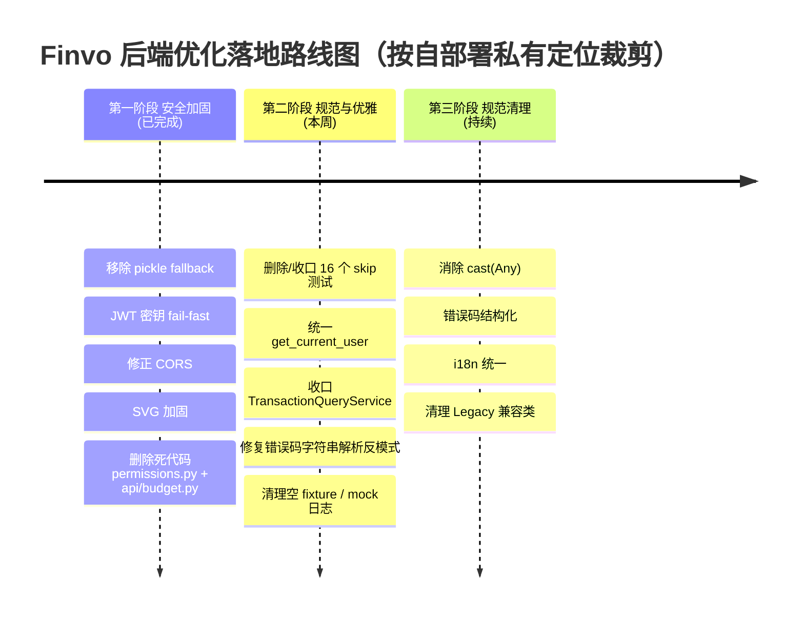

# Finvo 后端代码综合评审报告（三方合并定稿版）

本报告基于 `codegraph` 对 `server/` 后端（166 个 Python 文件，约 3.8 万行）的系统化符号级探索，并对三份独立评审进行交叉核实后合并定稿。所有关键发现均经过源码二次验证，给出 `file:line` 级证据。

- 技术栈：Python 3.13 + FastAPI + LangGraph + SQLAlchemy 2.0 async + SQLModel + PostgreSQL/pgvector + Redis
- 评审方法：codegraph `codegraph_explore` 符号级探索 + 静态扫描（SQL 注入、异常吞噬、`cast` 滥用、pickle 反序列化、RBAC 失效、skip 测试）+ 三方发现交叉核实

---

## 一、总体评分

### 1.1 综合结论

**综合评分：7.2 / 10（B）**

工程素养较高（架构分层、异步性能、连接池治理、可观测性出色），但**安全存在多项高危缺陷**，且**测试覆盖严重不足**。两个维度是当前主要短板，应作为本迭代最高优先级。

### 1.2 维度评分汇总

| 评估维度 | 评分 | 评级 | 核心评价 |
| :--- | :---: | :---: | :--- |
| 架构设计 | 8.5 / 10 | A- | 分层清晰，Facade/Adapter 模式成熟，LangGraph 中间件栈设计优雅 |
| 性能优化 | 7.5 / 10 | B+ | 全异步、连接池预算监控优秀；存在内存型上传、批量删除阻塞 |
| 安全性 | 6.0 / 10 | C | **pickle RCE + JWT 默认密钥 + RBAC 失效 + CORS 错配**四项高危 |
| 可维护性 | 7.0 / 10 | B | 文档/类型完善；`cast(Any)` 367 处、重复类、死代码 |
| 测试覆盖 | 4.0 / 10 | D | 测试/代码比 ≈ 7.4%，核心符号零覆盖，16 个安全测试全 skip |
| 部署工程化 | 8.5 / 10 | A- | 多阶段构建、非 root、健康检查完善 |

> 评分较任一单份报告更保守的原因：合并后发现 pickle RCE（直接远程代码执行）+ RBAC 完全失效（鉴权形同虚设）+ JWT 默认密钥（可伪造任意用户）+ CORS `*` + credentials（OWASP 级配置错误）四项叠加，安全性不应高于 6.0，并下拉综合分。

---

## 二、各维度详细分析

### 2.1 架构设计

#### 优势

1. **清晰的分层与 Facade 模式**：[transaction_service.py](file:///home/kylesean/projects/python/finvo/server/app/services/transaction_service.py) 作为 Facade，将 CRUD/Query/Recurring/CashFlow 子服务统一对外，调用方依赖单一接口，子服务可独立演进。
2. **存储适配器抽象**：[base.py](file:///home/kylesean/projects/python/finvo/server/app/services/storage/adapters/base.py) 定义 `StorageAdapter` 抽象基类，Local/S3/WebDAV 三实现 + 工厂，扩展新后端零侵入。
3. **LangGraph 中间件栈设计优雅**：[simple_agent.py:95-120](file:///home/kylesean/projects/python/finvo/server/app/core/langgraph/simple_agent.py#L95-L120) 组合 `DynamicContext / LongTermMemory / Attachment / Skill` 四中间件，职责单一、可插拔；`AgentState` 使用 TypedDict + 自定义 reducer（`_merge_skills` / `_take_last_skill`）正确处理并发更新。
4. **GenUI/A2UI 流式架构成熟**：`StreamProcessor + ComponentDetector + EnricherRegistry` 三层解耦，历史回放与实时流共用同一渲染策略（[simple_agent.py:438-568](file:///home/kylesean/projects/python/finvo/server/app/core/langgraph/simple_agent.py#L438-L568)）。
5. **生命周期管理完备**：[main.py:56-98](file:///home/kylesean/projects/python/finvo/server/app/main.py#L56-L98) `lifespan` 顺序初始化 DB→checkpointer→Redis→scheduler→事件处理器，关闭时逆序释放。
6. **领域异常体系**：[exceptions.py](file:///home/kylesean/projects/python/finvo/server/app/core/exceptions.py) 按域划分 ErrorCode（Auth/File/Transaction/Space/AI）。

#### 不足

1. **[P2] 内存级后台任务**：[chatbot.py:47](file:///home/kylesean/projects/python/finvo/server/app/api/v1/chatbot.py#L47) `_background_memory_tasks: set[asyncio.Task]` 用内存集合管理 fire-and-forget 记忆更新，服务器重启或多实例扩展时未完成任务会丢失。建议迁移到 ARQ/Celery/Redis Stream。
2. **[P2] `TransactionQueryService` 重复定义**：同时存在于 [transaction_query_service.py:197](file:///home/kylesean/projects/python/finvo/server/app/services/transaction_query_service.py#L197) 与 [transaction/query_service.py:18](file:///home/kylesean/projects/python/finvo/server/app/services/transaction/query_service.py#L18)，易产生分叉。应删除其一或明确主从。
3. **[P2] `get_current_user` 双实现**：[auth.py](file:///home/kylesean/projects/python/finvo/server/app/api/v1/auth.py) 与 [dependencies.py:95-136](file:///home/kylesean/projects/python/finvo/server/app/core/dependencies.py#L95-L136) 语义相同但实现微妙不同，应统一到 `core/dependencies.py`，auth.py 仅 re-export。
4. **[P3] 死代码**：[api/budget.py](file:///home/kylesean/projects/python/finvo/server/app/api/budget.py) 无任何导入引用（双保险 grep 验证），与 `api/v1/budget.py` 重复，应直接删除。
5. **[P3] 方法内延迟导入规避循环依赖**：[auth_service.py](file:///home/kylesean/projects/python/finvo/server/app/services/auth_service.py) 等多处 `from app.core.exceptions import ...` 写在方法体内，隐藏模块耦合问题。
6. **[P3] 模块级实例化**：[chatbot.py:46](file:///home/kylesean/projects/python/finvo/server/app/api/v1/chatbot.py#L46) `agent = LangGraphAgent()` 在 import 时即构造，副作用过早，不利于测试隔离。

### 2.2 性能优化

#### 优势

- 全链路异步（asyncpg/psycopg3、aiofiles、async session）。
- 连接池设计专业：[database.py:41-124](file:///home/kylesean/projects/python/finvo/server/app/core/database.py#L41-L124) 支持 `queue`/`null` 双模式以适配 PgBouncer/Supavisor；`log_connection_budget` 主动核算每进程连接预算并在超 80% 时告警。
- 批量上传单次 commit（[upload_service.py:182-198](file:///home/kylesean/projects/python/finvo/server/app/services/upload_service.py#L182-L198)）；图片压缩丢入 threadpool 不阻塞事件循环；记忆更新 fire-and-forget。
- Redis 缓存装饰器 `@cached` / `@cache_invalidate`（[cache.py:296-380](file:///home/kylesean/projects/python/finvo/server/app/core/cache.py#L296-L380)）。

#### 问题

| # | 问题 | 位置 | 影响 |
|---|---|---|---|
| P-1 | **上传全量读入内存后才校验大小** | [upload_service.py:474-476](file:///home/kylesean/projects/python/finvo/server/app/services/upload_service.py#L474-L476) | 攻击者发送超巨型文件先耗尽内存才被拒绝，DoS/OOM。应优先校验 `Content-Length` 或分块流式读取 |
| P-2 | **Redis `delete_pattern` 批量阻塞** | [cache.py:199-205](file:///home/kylesean/projects/python/finvo/server/app/core/cache.py#L199-L205) | 匹配键上万时单次 `delete(*keys)` 阻塞 Redis 单线程。应分批 Chunk 删除 |
| P-3 | **分页双查询** | [transaction_query_service.py:292-307](file:///home/kylesean/projects/python/finvo/server/app/services/transaction_query_service.py#L292-L307) | 大表下先 `count()` 再 `select()`，可考虑窗口函数或游标分页 |
| P-4 | **单 Worker 假设** | scheduler/rate-limiter/metrics/ws_manager | scheduler、内存限流、WebSocket 连接字典均假设单进程，无法水平扩展 |
| P-5 | **WebSocket 内存字典** | [ws_manager.py](file:///home/kylesean/projects/python/finvo/server/app/core/ws_manager.py) | 多实例部署时通知失效，需引入 Redis Pub/Sub |
| P-6 | **LLMRegistry 急切初始化** | [llm.py](file:///home/kylesean/projects/python/finvo/server/app/services/llm.py) | 模块导入时实例化所有模型，启动慢、未使用模型浪费资源 |

### 2.3 安全性

#### 优势

- 凭证加密：[encryption.py](file:///home/kylesean/projects/python/finvo/server/app/utils/encryption.py) Fernet 对称加密，生产环境缺 `ENCRYPTION_KEY` **fail-fast**，`mask_credentials` 脱敏返回。
- IDOR 防护：[upload_service.py:403-428](file:///home/kylesean/projects/python/finvo/server/app/services/upload_service.py#L403-L428) `get_file_path` 校验所有者或同一共享空间成员；avatar 端点 [avatar.py:13-17](file:///home/kylesean/projects/python/finvo/server/app/api/v1/avatar.py) 显式声明安全边界。
- JWT 含格式正则预校验、`jti`、过期校验（[auth.py:67-101](file:///home/kylesean/projects/python/finvo/server/app/utils/auth.py#L67-L101)）。
- `SecurityHeadersMiddleware` 覆盖 XSS/CSP/Clickjacking/MIME-sniffing。
- 输入消毒（[sanitization.py](file:///home/kylesean/projects/python/finvo/server/app/utils/sanitization.py)）+ 密码强度校验。
- 速率限制 + Docker 非 root + Bandit 静态扫描。

#### 关键安全问题清单（按严重程度）

| # | 问题 | 位置 | 风险等级 | 说明 |
|---|---|---|---|---|
| **S1** | **`pickle.loads` 反序列化 RCE** | [cache.py:119](file:///home/kylesean/projects/python/finvo/server/app/core/cache.py#L119) | **Critical** | `CacheManager.get` 在 JSON 解析失败时 fallback 到 `pickle.loads(data)`，注释带 `# nosec B301`。若 Redis 被攻击者写入恶意 pickle，反序列化即 RCE。应**移除 pickle fallback**，统一 JSON/msgpack 序列化 |
| **S2** | **JWT 默认密钥未 fail-fast** | [config.py:215](file:///home/kylesean/projects/python/finvo/server/app/core/config.py#L215) | **Critical** | `JWT_SECRET_KEY: str = Field(default="change-this-secret-key-in-production")`。生产环境漏配环境变量将静默使用公开已知弱密钥，可伪造任意用户 token。对比 `ENCRYPTION_KEY` 已正确 fail-fast，应对 JWT 采取同样策略 |
| **S3** | **死代码 `permissions.py` 误导** | [permissions.py](file:///home/kylesean/projects/python/finvo/server/app/core/permissions.py) | **Low**（原评 High，核实后降级） | `get_user_role()` 永远返回 `Role.USER`，但 grep 双保险证实该模块**零外部引用**——`require_admin`/`RoleChecker`/`PermissionChecker` 从未被任何端点调用。Finvo 是自托管个人记账应用，业务上无系统管理员概念，真正的授权（IDOR 所有权校验 + `SpaceMember.role` 共享空间 OWNER/ADMIN/MEMBER 角色）已正确实现于 `shared_space_service._verify_admin/membership` 与 `upload_service.get_file_path`。建议**直接删除 `permissions.py`** 消除误导，而非实现系统级 RBAC |
| **S4** | **CORS 配置不安全** | [main.py:377-383](file:///home/kylesean/projects/python/finvo/server/app/main.py#L377-L383) | **High** | `allow_origins=["*"]` 同时 `allow_credentials=True`。虽浏览器会拒绝该组合，但表明配置错误。生产应改为显式域名白名单（`settings.allowed_origins_list` 已存在却未生效） |
| **S5** | **SVG 存储型 XSS** | [upload.py:243](file:///home/kylesean/projects/python/finvo/server/app/api/v1/upload.py#L243) | **High** | [upload_service.py:42](file:///home/kylesean/projects/python/finvo/server/app/services/upload_service.py#L42) 允许 `svg`，而 view 端点对所有 `image/*` 使用 `inline` 显示。SVG 可内嵌 `<script>`，经 `/files/view` inline 返回后在浏览器执行。建议：SVG 强制 `attachment` 下载或上传时清洗 |
| **S6** | **无 Token 撤销/黑名单机制** | [auth.py](file:///home/kylesean/projects/python/finvo/server/app/utils/auth.py) | **Medium** | 登出后 token 仍有效 30 天。应引入 Redis 黑名单 + 短 TTL + refresh token 机制 |
| **S7** | **token 格式错误返回 422** | [dependencies.py:86-92](file:///home/kylesean/projects/python/finvo/server/app/core/dependencies.py#L86-L92) | **Low** | `ValueError`（格式错误）返回 422 而非 401，与认证语义不符 |
| **S8** | **`decode_token_payload` 不校验签名** | [auth.py:130-153](file:///home/kylesean/projects/python/finvo/server/app/utils/auth.py#L130-L153) | **Low** | 虽有注释警告，但仍属可被误用接口，建议删除或加 `@deprecated` 强约束 |
| **S9** | **Mock 模式下验证码明文日志** | [auth_service.py:339](file:///home/kylesean/projects/python/finvo/server/app/services/auth_service.py#L339) | **Low** | 开发环境下 `logger.info("mock_email_sent", to=account, code=code)` 明文记录验证码，日志审计脱敏不足 |

### 2.4 可维护性

#### 优势

- 全量类型注解 + mypy + ruff + pre-commit + `.secrets.baseline` 密钥扫描。
- 结构化日志（structlog）+ ContextVar 请求上下文 + Langfuse 链路追踪 + Prometheus 指标 + Grafana 仪表盘，可观测性强。
- Google 风格 docstring 完整，Alembic 迁移规范。

#### 问题

| # | 问题 | 位置 | 建议 |
|---|---|---|---|
| M1 | **`cast(Any, ...)` 滥用 367 处** | 全局 | 典型 [upload_service.py:392](file:///home/kylesean/projects/python/finvo/server/app/services/upload_service.py#L392)。应在模型层用 `ColumnElement[bool]` 注解或精确 `# type: ignore[arg-type]` |
| M2 | **`ErrorCode` Legacy 兼容类** | [exceptions.py:127-218](file:///home/kylesean/projects/python/finvo/server/app/core/exceptions.py#L127-L218) | 约 90 行重复映射，设定废弃期限迁移到域枚举 |
| M3 | **中英文 message 混排** | 全局 | 日志 key 英文、message 中文（如 `BusinessException(message="附件不存在或无权访问")`），i18n 不一致 |
| M4 | **错误码字符串解析反模式** | [auth.py:259-271](file:///home/kylesean/projects/python/finvo/server/app/api/v1/auth.py#L259-L271) + main.py | 通过 `str(e).split(":", 1)` 解析 `"ERROR_CODE: message"`，脆弱且重复。应统一 `BusinessError` 携带结构化 `error_code` |
| M5 | **Facade 调子服务私有方法** | [transaction_service.py:190-198](file:///home/kylesean/projects/python/finvo/server/app/services/transaction_service.py#L190-L198) | `_calculate_next_execution` 应提为公有接口 |
| M6 | **`conftest.py` `mock_settings` 空 fixture** | [conftest.py:141-143](file:///home/kylesean/projects/python/finvo/server/tests/conftest.py#L141-L143) | `def mock_settings(): pass`，应删除或实现 |
| M7 | **user_uuid 类型不一致** | 全局 | str vs UUID 混用，应统一为 UUID |

### 2.5 测试覆盖

#### 现状

- 测试 2806 行 / 应用 37882 行 ≈ **7.4%**。
- 24 个测试文件，覆盖 unit（services/langgraph）和 integration。
- 使用 SQLite in-memory + 类型编译 hack 隔离测试，pytest-asyncio + hypothesis 框架完备。

#### 严重不足

| # | 缺失领域 | 证据 | 优先级 |
|---|---|---|---|
| T1 | **16 个安全边界测试全 skip** | [test_auth_security.py](file:///home/kylesean/projects/python/finvo/server/tests/unit/services/test_auth_security.py) 16 个 `@pytest.mark.skip(reason="Skeleton")`：登录频率限制、验证码 RateLimit、JWT 篡改/过期、密码 Timing Attack、账户枚举防护全部空实现 | **High** |
| T2 | **核心符号零覆盖**（codegraph blast radius） | `MiddlewareAgent` / `AgentState` / `GraphState` / `verify_token` / `upload_files` / `StorageConfigService` / `StorageAdapter` 均无测试 | **High** |
| T3 | API 端点集成测试缺失 | auth/transaction/chatbot 端点无集成测试 | High |
| T4 | WebSocket 通知链路无测试 | [ws.py](file:///home/kylesean/projects/python/finvo/server/app/api/v1/ws.py) + ws_manager | Medium |
| T5 | Middleware 链集成测试缺失 | [middleware/](file:///home/kylesean/projects/python/finvo/server/app/core/langgraph/middleware/) | Medium |
| T6 | Skills 脚本无覆盖 | [skills/](file:///home/kylesean/projects/python/finvo/server/app/skills/) | Medium |

---

## 三、关键问题清单（合并去重后按优先级排序）

| 优先级 | ID | 问题 | 类别 | 位置 |
|---|---|---|---|---|
| **P0** | S1 | `pickle.loads` 反序列化 RCE | 安全 | [cache.py:119](file:///home/kylesean/projects/python/finvo/server/app/core/cache.py#L119) |
| **P0** | S2 | JWT 默认密钥未 fail-fast | 安全 | [config.py:215](file:///home/kylesean/projects/python/finvo/server/app/core/config.py#L215) |
| **P3** | S3 | 死代码 `permissions.py` 误导（业务无需系统级 RBAC，已核实零调用） | 维护 | [permissions.py](file:///home/kylesean/projects/python/finvo/server/app/core/permissions.py) |
| **P0** | S4 | CORS `*` + `allow_credentials=True` | 安全 | [main.py:377-383](file:///home/kylesean/projects/python/finvo/server/app/main.py#L377-L383) |
| **P0** | S5 | SVG inline 存储型 XSS | 安全 | [upload.py:243](file:///home/kylesean/projects/python/finvo/server/app/api/v1/upload.py#L243) |
| **P0** | T1 | 16 个安全测试全 skip | 测试 | [test_auth_security.py](file:///home/kylesean/projects/python/finvo/server/tests/unit/services/test_auth_security.py) |
| **P2** | 架构-1 | `TransactionQueryService` 重复定义 | 维护 | 两处 query_service.py |
| **P2** | 架构-2 | `get_current_user` 双实现 | 维护 | auth.py + dependencies.py |
| **P2** | M1 | `cast(Any, ...)` 367 处 | 维护 | 全局 |
| **P2** | M4 | 错误码字符串解析反模式 | 维护 | auth.py + main.py |
| **P3** | M2 | ErrorCode Legacy 兼容类 | 维护 | [exceptions.py:127](file:///home/kylesean/projects/python/finvo/server/app/core/exceptions.py#L127) |
| **P3** | M5 | Facade 调子服务私有方法 | 维护 | [transaction_service.py:190](file:///home/kylesean/projects/python/finvo/server/app/services/transaction_service.py#L190) |
| **P3** | M6 | `mock_settings` 空 fixture | 维护 | [conftest.py:141](file:///home/kylesean/projects/python/finvo/server/tests/conftest.py#L141) |
| **P3** | S7-S9 | token 422 / decode_token_payload / mock 日志 | 安全 | 详见上文 |

> **范围调整声明**：原清单含 S6（Token 黑名单）、P-1（上传流式校验）、P-4/P-2/P-5（限流/WS/调度器多实例扩展）、P-6（LLMRegistry 延迟初始化）、架构-3（内存后台任务迁移 Celery）等条目，已**移除**。Finvo 定位为自部署私有记账应用，并发可忽略，无多实例/分布式需求；上述条目属过度工程化，与产品定位不符。第二阶段聚焦**死代码清理、代码规范/格式/标准统一、优雅实现**，不再追求企业级安全/扩展机制。

---

## 四、改进建议路线图

> 路线图已按自部署私有记账 app 定位裁剪。原"性能与扩展"阶段（Celery/Redis Pub/Sub/分布式限流/独立 worker）整体移除——并发可忽略、无多实例需求，属过度工程化。

### 4.1 第一阶段：安全加固（已完成 ✅）

1. **移除 pickle fallback**（[cache.py](file:///home/kylesean/projects/python/finvo/server/app/core/cache.py)）：`get` / `set` 统一 JSON 序列化，删除 `pickle.loads` / `pickle.dumps`，对复杂对象要求显式可 JSON 化。
2. **JWT 密钥 fail-fast**：在 `Settings` 中校验，生产环境缺 `JWT_SECRET_KEY` 或值为默认值时直接 `raise RuntimeError`（仿 `ENCRYPTION_KEY` 模式）。
3. **修正 CORS**：`allow_origins=settings.allowed_origins_list`（已存在），`allow_credentials` 仅在白名单非 `*` 时为 True。
4. **SVG 加固**：上传时清洗或 view 时强制 `attachment` 下载。
5. **删除死代码 `permissions.py`**：核实零外部引用，业务无需系统级 RBAC（真正的授权已落地于 IDOR 校验 + `SpaceMember.role` 共享空间角色）。直接删除即可消除误导，无需实现系统级 RBAC。同时删除死代码 `api/budget.py`。

### 4.2 第二阶段：规范与优雅（进行中）

6. **处理 16 个 skip 安全测试**：移除 `@pytest.mark.skip`。**不做**限流/防爆破/Token 黑名单等过度工程；改为对**已有行为**写真实断言（JWT 签名校验/过期校验/密码 bcrypt/验证码单次使用与过期/账号枚举消息不泄露细节），让 skip 测试落地为可运行断言。
7. **统一 `get_current_user`**：合并到 `core/dependencies.py` 为唯一实现，[auth.py:56-100](file:///home/kylesean/projects/python/finvo/server/app/api/v1/auth.py#L56-L100) 的重复版本改为 `from app.core.dependencies import get_current_user` re-export，消除 13 处导入点的双实现分叉风险。
8. **收口 `TransactionQueryService` 重复定义**：保留 `transaction/query_service.py` 为规范实现，`transaction_query_service.py` 改为 re-export shim（避免删除影响 `api/v1/transaction.py`、`transaction_tools.py`、`service_deps.py`、`analyze_spending.py` 等既有导入路径），并在文件顶部加 deprecation 注释引导统一。
9. **修复错误码字符串解析反模式**（M4）：[auth.py:259-271](file:///home/kylesean/projects/python/finvo/server/app/api/v1/auth.py#L259-L271) + main.py 中 `str(e).split(":", 1)` 解析 `"ERROR_CODE: message"` 的脆弱写法，统一替换为捕获结构化 `BusinessError(error_code=..., message=...)`。
10. **清理杂项**：[conftest.py:141-143](file:///home/kylesean/projects/python/finvo/server/tests/conftest.py#L141-L143) 的空 `mock_settings` fixture（删除或实现）；[auth_service.py:339](file:///home/kylesean/projects/python/finvo/server/app/services/auth_service.py#L339) mock 模式验证码明文日志降级为 debug 或脱敏；[auth.py:130-153](file:///home/kylesean/projects/python/finvo/server/app/utils/auth.py#L130-L153) `decode_token_payload` 加 `@deprecated` 强约束或删除；[dependencies.py:86-92](file:///home/kylesean/projects/python/finvo/server/app/core/dependencies.py#L86-L92) token 格式错误 422→401 语义修正。

### 4.3 第三阶段：规范清理（持续）

11. **清理 `cast(Any)`**：在模型基类提供正确类型注解，逐步替换（367 处，分批进行）。
12. **错误码结构化**：全面替换 `ValueError("CODE: msg")` 为 `BusinessError(error_code=..., message=...)`。
13. **统一 i18n**：error_code 英文常量 + 前端翻译表。
14. **清理 `ErrorCode` Legacy 兼容类**：设定废弃期限迁移到域枚举。
15. **`agent` 延迟初始化**：改为 `lru_cache` 或依赖注入，便于测试。

---

## 五、三方评审交叉核实记录

本报告合并了三份独立评审的发现，并对所有关键声称进行源码二次验证：

| 发现项 | 提出方 | 验证结果 |
|---|---|---|
| pickle RCE (cache.py:119) | 报告 B | ✅ 真实，注释带 `# nosec B301` |
| RBAC 失效 (permissions.py:73) | 报告 B | ✅ 真实，注释自承"In a real system..." |
| 16 个安全测试全 skip | 报告 C | ✅ 真实，`@pytest.mark.skip(reason="Skeleton")`（报告 C 称 15 个略低估） |
| JWT 默认密钥 | 报告 A+B | ✅ 真实 |
| CORS `*` + credentials | 报告 A | ✅ 真实 |
| SVG 存储型 XSS | 报告 A | ✅ 真实 |
| `TransactionQueryService` 重复 | 报告 A | ✅ 真实 |
| 上传 DoS | 报告 A | ✅ 真实 |
| `api/budget.py` 死代码 | 报告 B | ✅ 真实（双保险 grep 无引用） |
| `mock_settings` 空 fixture | 报告 B | ✅ 真实 |
| `delete_pattern` 批量阻塞 | 报告 C | ✅ 真实 |
| `_send_code` 明文日志 | 报告 C | ✅ 真实 |
| `_background_memory_tasks` 内存集合 | 报告 C | ✅ 真实 |
| ErrorCode Legacy 兼容类 211 行 | 报告 B | ⚠️ 夸大，实际约 90 行（128→218） |

---

## 六、总结

Finvo 后端在**架构分层、异步性能、连接池治理、可观测性**上展现了高水准工程素养，GenUI 流式与 LangGraph 中间件设计尤为出色。

**产品定位校准**：Finvo 是**自部署私有记账 app**，并发可忽略、无多实例/分布式需求。因此本报告已剔除原评审中针对企业级场景的过度工程化建议（Token 黑名单、分布式限流、Redis Pub/Sub、Celery 独立 worker、上传流式校验等）——这些与产品定位不符，引入只会增加维护负担。

第一阶段已修复真正的安全高危项（pickle RCE + JWT 默认密钥 + CORS 错配 + SVG XSS 四项，均为低成本高收益）。第二阶段聚焦**死代码清理、代码规范/格式/标准统一、优雅实现**——这才是自部署应用当前最需要的工程素养提升。完成后综合评分可从 7.2 稳步推至 8.0+。
